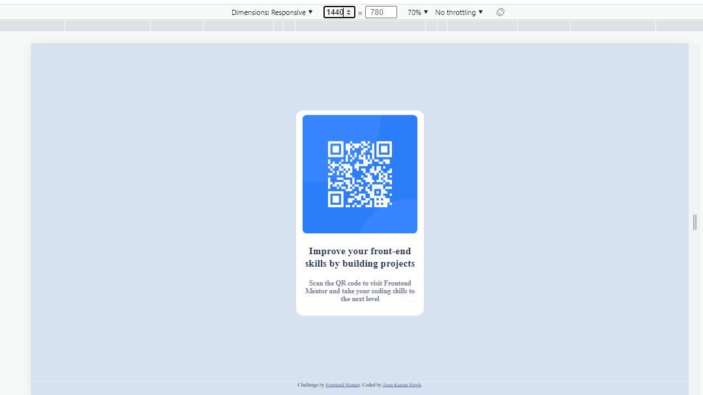
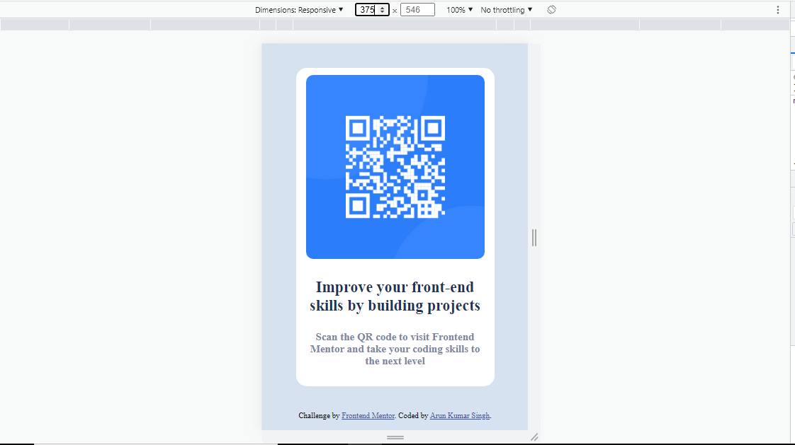

# fontendMentorChallenge1
Frontend Mentor | QR code component

# Frontend Mentor - QR code component solution

This is a solution to the [QR code component challenge on Frontend Mentor](https://www.frontendmentor.io/challenges/qr-code-component-iux_sIO_H). Frontend Mentor challenges help you improve your coding skills by building realistic projects. 

## Table of contents

- [Overview](#overview)
  - [Screenshot](#screenshot)
  - [Links](#links)
- [My process](#my-process)
  - [Built with](#built-with)
  <!-- - [What I learned](#what-i-learned)-->
  - [Continued development](#continued-development)
  <!-- - [Useful resources](#useful-resources)-->
- [Author](#author)
<!-- - [Acknowledgments](#acknowledgments)-->

## Overview

### Screenshot

Desktop

Mobile

### Links

- Solution URL: [Click me](https://github.com/arunsingh009/fontendMentorChallenge1)
- Live Site URL: [CLick me](https://arunsingh009.github.io/fontendMentorChallenge1/)

## My process

### Built with

- Semantic HTML5 markup
- CSS custom properties
- Flexbox

### Continued development

In future I wolud like to work on CSS grid because I am very poor at it.

## Author

- Website - [Arun Kumar SIngh](https://arunkumarsinghportfolio.netlify.app/)
- Frontend Mentor - [@arunsingh009](https://www.frontendmentor.io/profile/arunsingh009)
- Twitter - [@arunsingh641997](https://twitter.com/arunsingh641997?t=VKd9A8qNMOTva6b_zItkqA&s=09)
